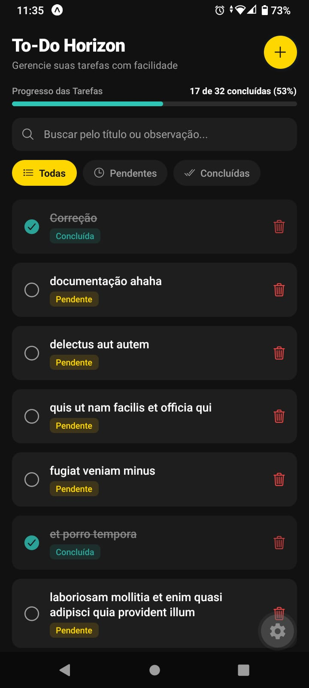
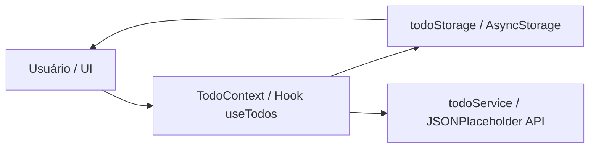

<p align="center"><a href="https://github.com/Carlos2505dev/testetecnico_Horizon" target="_blank"></a></p>

<p align="center">
<a href="https://opensource.org/licenses/MIT"></a>
<a href="https://expo.dev"></a>
<a href="https://github.com/Carlos2505dev/testetecnico_Horizon"></a>
</p>

<p align="center">
<a href="https://skillicons.dev">
  
</a>
</p>

## Sobre o Projeto

**Gerenciamento de tarefas simples, fluido, acessível e com persistência offline.**

O **To-Do Horizon** é um aplicativo móvel completo desenvolvido em **React Native** com **TypeScript** e **Expo Router** para avaliação no Teste Técnico de Desenvolvedor Mobile Júnior I da **Horizon Software**.

O aplicativo consome a API pública **JSONPlaceholder** (endpoint `/todos`) e oferece um fluxo completo de **CRUD** (Criar, Ler, Atualizar e Deletar tarefas) integrado a uma estratégia robusta de sincronização em segundo plano e cache local com `@react-native-async-storage/async-storage`.

> **Destaque:** Como a API JSONPlaceholder simula gravações sem persistência real no servidor, a arquitetura do To-Do Horizon gerencia os dados com a abordagem *Single Source of Truth* via **React Context**, garantindo que edições e alterações locais sejam refletidas instantaneamente na interface e fiquem salvas no dispositivo mesmo quando offline.

## ✨ O que o Projeto faz

Recursos e status das funcionalidades da especificação técnica:

| Recurso                                 | O que resolve                                                | Status     |
| --------------------------------------- | ------------------------------------------------------------ | ---------- |
| **Listagem & Status Visual**            | Exibe tarefas com indicadores visuais de pendente/concluída  | ✅ Pronto  |
| **Criação de Tarefas**                  | Formulário completo com validação rigorosa de título         | ✅ Pronto  |
| **Edição Completa**                     | Edita título, observações/descrição e status em tempo real   | ✅ Pronto  |
| **Exclusão com Modal de Confirmação**  | Previne exclusões acidentais com modal dedicado e toast undo| ✅ Pronto  |
| **Tela de Detalhes**                    | Visualização detalhada com horário de criação e observações  | ✅ Pronto  |
| **Busca por Título e Descrição**        | Filtra tarefas por palavra-chave localmente sem chamadas API | ✅ Pronto  |
| **Filtros por Status**                  | Seleção rápida por 'Todas', 'Pendentes' e 'Concluídas'        | ✅ Pronto  |
| **Contador & Barra de Progresso**       | Indicador visual de avanço (ex: "7 de 25 concluídas")        | ✅ Pronto  |
| **Modo Offline & Cache Local**          | Mantém acesso e suporte a retry em desconexão                | ✅ Pronto  |
| **Feedback Háptico**                    | Vibração sutil ao concluir, salvar e excluir tarefas         | ✅ Pronto  |
| **Limpeza em Lote de Concluídas**       | Ação para remover todas as tarefas concluídas de uma vez     | ✅ Pronto  |
| **Testes Unitários com Jest**           | Suíte automatizada para validações, filtros e storage        | ✅ Pronto  |

<details>
<summary><strong>📋 Ver todos os detalhes técnicos das funcionalidades</strong></summary>

### Gestão de Tarefas

* Alternância rápida de status (toggle completion) diretamente na lista.
* Validação estrita: título obrigatório, entre 3 e 100 caracteres.
* Campo opcional de observações/descrição estendido até 500 caracteres.
* Exclusão segura com modal de confirmação e opção de desfazer (Undo Toast).
* Limpeza em lote de tarefas concluídas com scroll horizontal nos chips de filtro.

### Desempenho e Acessibilidade

* Busca e filtragem 100% locais sem chamadas à API por caractere digitado.
* Suporte completo a leitores de tela (`TalkBack` e `VoiceOver`) com `accessibilityRole`, `accessibilityState` e rótulos auditados.
* Relação de contraste e consistência em conformidade com as diretrizes **WCAG 2.1 (AA)** nos temas claro e escuro.

### Testes e Qualidade

* 4 Suítes de testes unitários com **Jest** e `@testing-library/react-native` (19/19 testes aprovados).
* Checagem estrita de tipos com **TypeScript** sem nenhum erro de compilação (`tsc --noEmit`).

</details>

## 🎬 Demonstração

<p align="center">
  
</p>

<div style="display:flex;gap:14px;border-left:4px solid #F5B800;padding:12px 16px;border-radius:6px;background:rgba(245, 184, 0, 0.08);align-items:flex-start">
  <div style="flex:0 0 44px;display:flex;align-items:center;justify-content:center">
    <div style="width:36px;height:36px;border-radius:8px;background:rgba(245, 184, 0, 0.2);display:flex;align-items:center;justify-content:center;color:#D97706;font-weight:700">
      💡
    </div>
  </div>
  <div style="min-width:0">
    <div style="font-weight:600;color:#D97706;margin-bottom:4px">Modo Offline e Persistência</div>
    <div>O aplicativo pode ser executado offline no <strong>Expo Go</strong>. Suas tarefas criadas ou editadas ficam salvas localmente no dispositivo via <code>AsyncStorage</code> e são exibidas imediatamente com banner de notificação.</div>
  </div>
</div>

## 📦 Instalação

### Pré-requisitos

```text
Node.js >= 18.0.0
npm ou yarn
Expo Go instalado no seu dispositivo móvel (Android/iOS)
```

### Instalação e Execução

```bash
# 1. Clone o repositório
git clone https://github.com/Carlos2505dev/testetecnico_Horizon.git

# 2. Acesse a pasta do projeto
cd testetecnico_Horizon

# 3. Instale as dependências
npm install

# 4. Inicie o servidor de desenvolvimento do Expo
npx expo start
```

Abra o **Expo Go** no seu smartphone e leia o QrCode exibido no terminal.

## 🚀 Primeiros Passos

### 1. Criar uma Nova Tarefa

Toque no botão **"+"** no canto superior direito para abrir o formulário. Insira o título (obrigatório, de 3 a 100 caracteres) e observações opcionais.

### 2. Alternar Status

Toque no checkbox circular ao lado de qualquer tarefa da lista para alterar o status entre **Pendente** e **Concluída**. Sinta o feedback háptico.

### 3. Filtrar e Buscar

Utilize o campo de busca superior para filtrar tarefas por título ou observação sem consumo de dados de rede. Utilize os chips para filtrar por status.

### 4. Visualizar Detalhes e Editar

Toque no card de uma tarefa para abrir a tela de detalhes completa, visualizando o horário de criação e acessando a edição.

### 5. Testar o Modo Offline

Desative o Wi-Fi/dados móveis do seu smartphone. O app exibirá o banner em amarelo do modo offline com o botão **"Tentar novamente"**, mantendo a navegação ativa.

## 🧠 Como Funciona

### Fluxo de Dados e Sincronização



O gerenciamento de estado é centralizado via **`TodoContext`** (`src/context/todo-context.tsx`). As modificações feitas pelo usuário atualizam a memória reativa e são persistidas no `AsyncStorage`, garantindo sincronismo instantâneo entre telas e funcionamento offline.

<details>
<summary><strong>🏗️ Detalhes da Arquitetura e Decisões de Engenharia</strong></summary>

### Organização de Camadas

| Camada | Diretórios / Arquivos | Responsabilidade |
| :--- | :--- | :--- |
| **Apresentação** | `src/app`, `src/components` | Telas do Expo Router, componentes visuais e estados de UI |
| **Estado & Domínio** | `src/context`, `src/hooks` | Gerenciamento de estado global (`TodoContext`) e custom hooks |
| **Persistência** | `src/storage` | Cache local e operações no `AsyncStorage` |
| **Serviços de Rede** | `src/services` | Comunicação HTTP com a API pública (JSONPlaceholder) |
| **Contratos** | `src/types` | Interfaces e tipos TypeScript compartilhados |

### Decisão: TypeScript ao invés de JavaScript

O projeto adota TypeScript em vez de JavaScript para garantir a checagem estrita de tipos em todas as camadas (serviços de API, formulários e armazenamento local). A tipagem rigorosa evita erros silenciosos em tempo de execução e facilita a manutenção contínua.

### Decisão: React Context para Gerenciamento de Estado

Centraliza o estado das tarefas em uma única fonte da verdade (*Single Source of Truth*), garantindo que edições na tela de formulário atualizem instantaneamente a tela de detalhes e a lista principal sem re-renders contínuos.

### Decisão: Sincronização Híbrida (API + AsyncStorage)

Devido ao comportamento estático/simulado da API JSONPlaceholder, as alterações (POST, PATCH, DELETE) validam as requisições HTTP e aplicam a alteração no cache local do dispositivo, assegurando a persistência real das modificações efetuadas.

</details>

## ⚙️ Configurações Avançadas e Scripts

<details>
<summary><strong>🧪 Execução de Testes e Checagens de Qualidade</strong></summary>

### Testes Unitários (Jest)

```bash
npm test
```

### Checagem de Tipagem TypeScript

```bash
npx tsc --noEmit
```

### Iniciar com Cache Limpo no Expo

```bash
npx expo start -c
```

</details>

## 📚 Documentação do Repositório

| Documento | Descrição |
| :--- | :--- |
| [README.md](./README.md) | Visão geral do projeto, guia de instalação e decisões de arquitetura |
| [docs/spec.md](./docs/spec.md) | Especificação técnica e requisitos funcionais |
| [docs/sprints.md](./docs/sprints.md) | Planejamento e acompanhamento de tarefas por Sprint |

## 📜 Licença

Este projeto está licenciado sob a **MIT License**.

<div align="center">
  
  <p><em>To-Do Horizon: Gerencie suas tarefas com facilidade e eficiência.</em></p>
  <p><a href="#top">⬆ Voltar ao topo</a></p>
</div>
